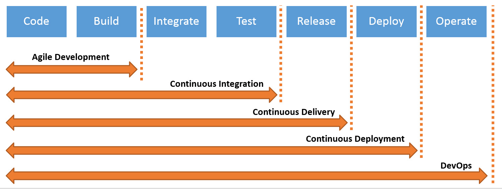

# Cloud Service Provider 
- a provider of cloud infrastructure, including cloud computing, networking, security
- benefits of using cloud based infrastructure include:
    - more efficient use of resources
    - security (highly configurable, build in resources)
    - scalability
    - redundance and global distribution
    - flexibility

# Azure Services

## Virtual Machines
- on demand, scalable computing resource
- allows you to allocate virtual processing units and storage to run processes on without needing to maintain any physical hardware
- virtual machines follow the infrastructure as a service model (or IaaS), meaning the physical hardware and virtualization is handled by the cloud service provider, but the software that runs on it must still be maintained
- Virtual machines can be created with Windows OS or with one of many linux distributions, as well as with your own linux distribution
- VMs can be used in your development process, to test your application, and to deploy your applications to the cloud 
- VMs are customizable by size can easily be scaled - resizing, adding more disk storage (vertical scaling) or using scale sets (horizontal scaling)
- [**Security groups**](https://docs.microsoft.com/en-us/azure/virtual-network/network-security-groups-overview) can be used to filter network traffic to VMs and other Azure resources, allowing us to define rules based on ports and IP addresses that are whitelisted for network traffic

### Disks
- all of Azure's storage solutions are designed to be durable, highly available, secure, and scalable
- [Azure Disks](https://docs.microsoft.com/en-us/azure/virtual-machines/managed-disks-overview) provide block-level storage volumes for Azure VMs
- allows data to be persistently stored and accessed from an attached virtual disk
- create 3 replicas of your data for high durability, in at least 3 separate availability zones
- server side encryption of your data at rest is enabled by default

## [Global Infrastructure](https://azure.microsoft.com/en-us/global-infrastructure/geographies/#geographies)

### Regions 
- a set of data centers in a relatively similar geographic area, connected by a regional network 
- 'West US' 'North Europe' 'Southeast Asia' etc.

### Availability Zones
- unique physical locations within an Azure region
- made up of one or more data center(s) equipped with independent power, cooling, and networking
- often times 

## Blob Storage
- unstructured data to be stored and access at an incredibly large scale
- a blob represents an item to store, and are organized into containers
- more metadata associated with each item than in other types of storage
- nearly infinite scalability
- good for storing large amounts of any unstructured data, but can also be used to host static web pages

<!-- 
# DevOps 

## [Continuous Integration, Continuous Delivery, Continuous Deployment](https://www.atlassian.com/continuous-delivery/principles/continuous-integration-vs-delivery-vs-deployment)

(image source: https://www.bmc.com/blogs/continuous-delivery-continuous-deployment-continuous-integration-whats-difference/) -->